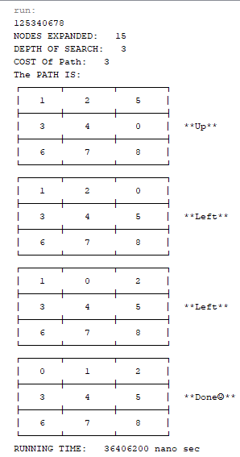
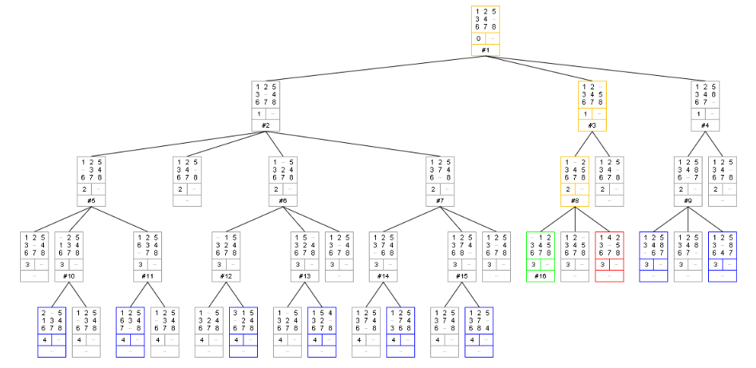
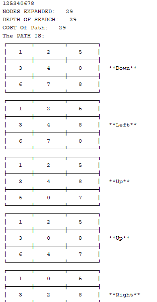
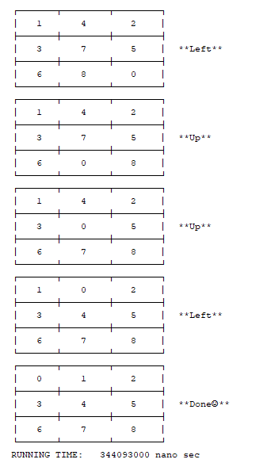
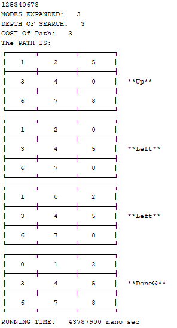
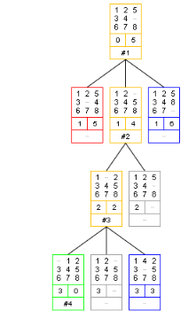

## Assumptions & Other Details

- We assume that each state is just a string of numbers from 0 to 8 and the 0 refers to the blank space.
- We assume that the number of nodes of the tree we will pass over wouldn’t exceed 10000 nodes so that the size of nodes array was 10000.
- To add the cost and the heuristic of each state we make a string and add this number before the state before # symbol for example the state 102345678 have the cost of 1 and the Manhattan distance heuristics of 1 so it would be 2#102345678.
- The depth of search of the DFS algorithm increases each time we dig deeper in the tree so the depth will increase each time if it’s in the same direction of moving so we use an indicator to check this condition.
- The depth of search of BFS algorithm increases each time all the nodes in some level finished and we use an indicator to check this condition.
- We assume that the priority of ties in the case of draw is (Left-Right-Up-Down)
- The user could enter the state continuously like 102345678 or comma separated like 1,0,2,3,4,5,6,7,8
- The code would throw out an error if it received invalid state.
- To reach the path to goal, we pass over the nodes after reaching the goal from last to first to print all the moves and the state after each move.
- We assume the cost of each step are equally and equals one.
- The number of nodes expanded are the nodes that get out of the frontier list and their children were added.
- After testing the Manhattan distance and the Euclidean distance we found out the Manhattan distance is better because it generates fewer nodes in the search tree. And among the admissible heuristics, Manhattan Distance is the most efficient
- This site https://tristanpenman.com/demos/n-puzzle/ helps for visualization and check a lot of test cases.
- There was no need for decreasing the key of each state in A* because it will be always the shortest path to it that was found the first time because the heuristics of each state will never change for the same goal state and the cost of all steps always equals 1.

## Used Data Structures

For ***BFS*** algorithm we use **Queue** as data type for frontier list.
For ***DFS*** algorithm we use **Stack** as data type for frontier list.
For ***A**** algorithm we use **Priority-Queue** as data type for frontier list.

## Test Cases

♦ 1,2,5,3,4,0,6,7,8

**=>BFS**

**==>DFS**

**==>A***

## Further Recommendations

1. A little change on the code can make it works also on 15-puzzle so I recommend taking the size of the puzzle from the user and change some static information with division and modulus and after these little modifications the code will solve any size of puzzle.
2. It would be better to get the goal state from the user at the begging and let the code find the steps to reach that goal.
3. We recommend using linked list instead of arrays to store explored nodes and tree nodes as this would increase efficiency and decrease memory usage.
4. We recommend collecting all the search algorithms together in on code and give the user options to choose any of them and we didn’t collect them together because we worked on them separately at different time.
